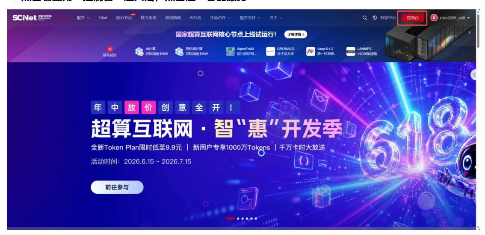
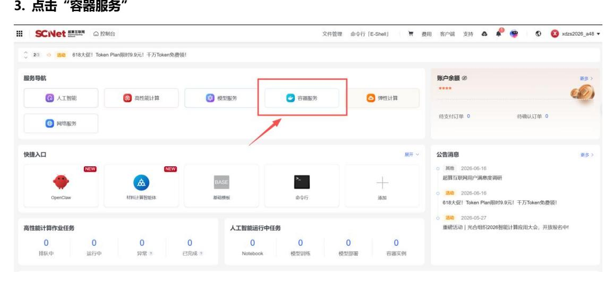
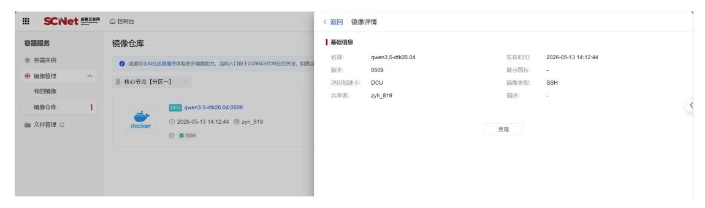
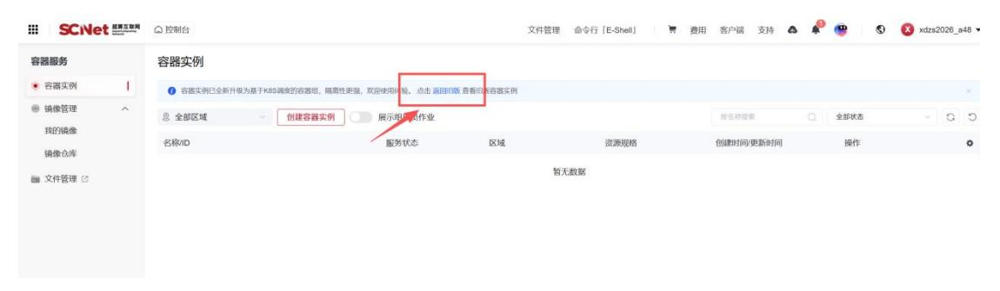
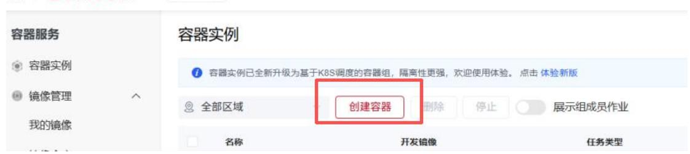
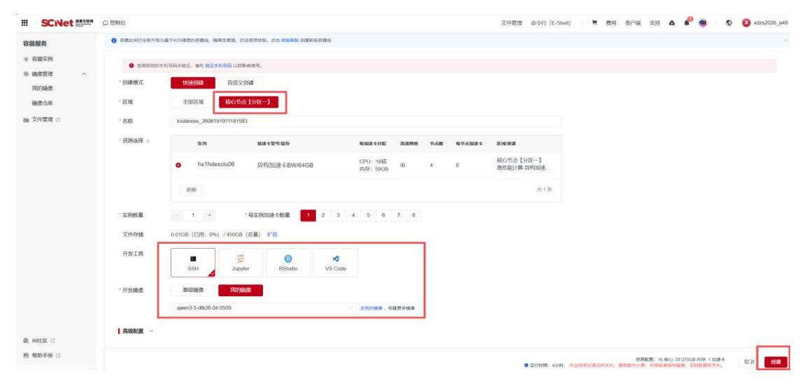
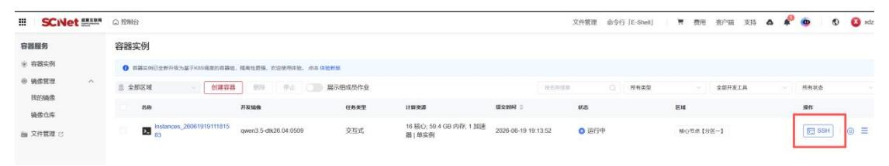
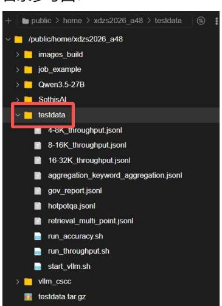
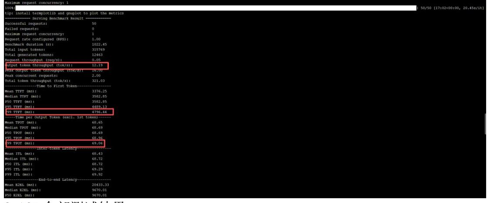
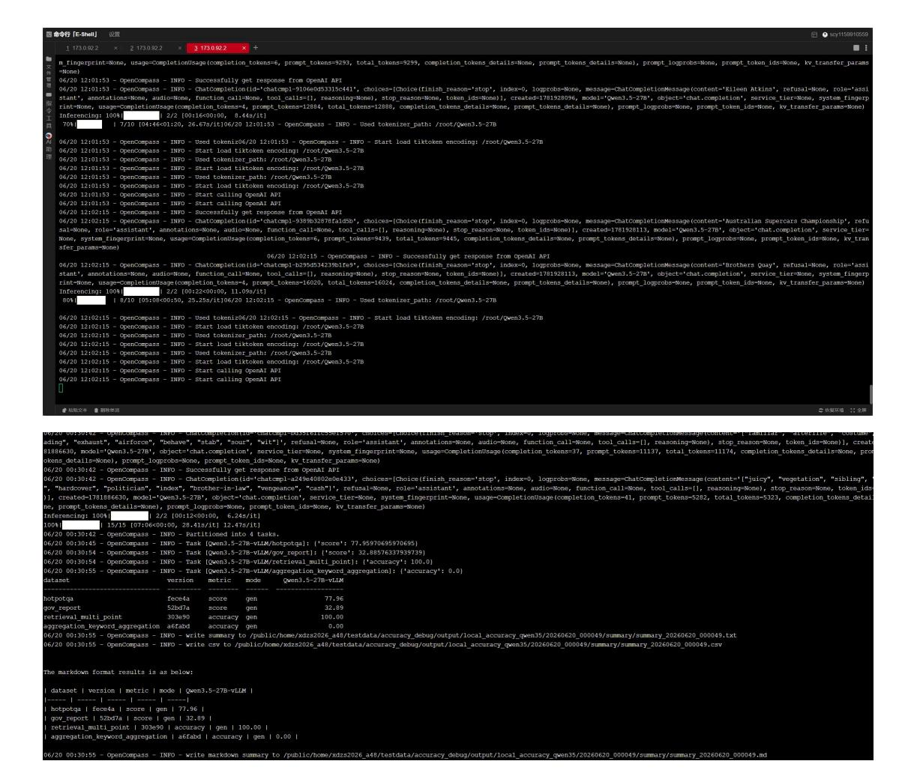

# **SCNet 选手测试调试文档**

**1. 超算平台 <https://www.scnet.cn> 用户用账号密码进行登陆**


**2. 点击右上角"控制台"进入后,点击选"容器服务"**





**4. 依次点击"镜像管理-镜像仓库-核心节点分区一"搜索镜像 qwen3.5-dtk26.04:0509,克隆到我的镜 像里面。**



## **5. 点击"容器实例-返回旧版"**



### 点击"创建容器"




注意选择"核心节点分区一"的 hx1hdexclu08 队列,开发工具选择"SSH",点击"我的镜像",选择 好自己刚刚克隆的镜像后点击右下角的"创建"。



### **6. 点击 ssh 进入容器**



# **7. 安装 vllm 源码 操作在用户家目录下执行**

**注意:容器实例停止后,非用户家目录的数据将会丢失,所以尽量保证文件数据等存放和操作都在家目录 下进行**

## **执行:**

git clone -b v0.18.1 --depth 1 [http://developer.sourcefind.cn/codes/OpenDAS/vllm\\_cscc.git](http://developer.sourcefind.cn/codes/OpenDAS/vllm_cscc.git) cd vllm\_cscc

python setup.py bdist\_wheel #根据修改源码重新构建 vLLM 编译包 首次执行需十分钟左右,后续编译 时间大概两分钟。**vllm 的编译和下面的下载操作需要每次在重新启动容器实例后重 新执行**

cd dist

pip install vllm-\*.whl --no-deps #下载 vllm 库

这里安装的是比赛基线使用的 vLLM 版本。当选手后续对 vLLM 做了 kernel、调度、算子融合、编译参 数等优化,最终也需要能重新编译出 dist/vllm-\*.whl 并可正常安装,评测脚本也会依据此进行。

### **8. 下载 Qwen-3.5-27B 模型**

### **返回到用户家目录 执行:**

pip install modelscope

modelscope download --model Qwen/Qwen3.5-27B --local\_dir ./Qwen3.5-27B #下载模型路径 cp -r ./Qwen3.5-27B/ /root/Qwen3.5-27B #注意模型下载到家目录,后续每次启动容器后,启动 vllm 服务时 copy 一份到/root 目录下,在/root 下加载模型时间较快

#### **9. 下载共享测试 data 和脚本**

请在 Linux 服务器输入链接下载文件

curl -f -C - -o testdata.tar.gz

https://zzefile.scnet.cn:65011/efile/s/d/c2N5MTE1OTkxMDU1OQ==/a927e65672549b46 mkdir -p ./testdata

tar -xzf testdata.tar.gz -C ./testdata --strip-components=1

# 目录参考图:



```
解压完成后,testdata 目录下应包含以下内容:
吞吐测试数据集:
4-8K_throughput.jsonl
8-16K_throughput.jsonl
16-32K_throughput.jsonl
精度测试数据集:
hotpotqa.jsonl
gov_report.jsonl retrieval_multi_point.jsonl aggregation_keyword_aggregation.jsonl
脚本:
start_vllm.sh
```

# #进入 testdata 并赋权

run\_throughput.sh run\_accuracy.sh

chmod +x \*.sh

## **10. 启动 vllm 测试脚本**

### **以下都在用户家目录下 testdata 目录执行 :**

./start\_vllm.sh

再次提醒注意模型下载到家目录,后续每次启动容器后,启动 vllm 服务时 copy 一份到/root 目录下,在 /root 下加载模型时间较快

启动服务成功出现界面,注意后续测试该服务终端和脚本不能停止或关闭

hy-smi # 查看 DCU 显卡情况

另起终端,尝试单次推理 目的验证服务是否启动成功,首次服务启动约需十分钟。

curl http://127.0.0.1:8001/v1/chat/completions \

```
-H "Content-Type: application/json" \
```

```
-d '{ "model": "Qwen3.5-27B", "messages": [
```

```
{"role": "user", "content": "你好,简单回复一句话。"}
 ],"temperature": 0.0, "max_tokens": 64
}'回复验证模型服务部署成功
```

**每次服务关闭,容器关闭都需重新启动该脚本服务的。作用是启动本地 vLLM 推理服务。 该服务默认监听 127.0.0.1:8001,供后续吞吐测试和精度测试调用。**

# **10.测试吞吐脚本 新终端进入 testdata 执行**

./run\_throughput.sh #执行全部类型数据集全部测试

- ./run\_throughput.sh all 10 #全部数据集都只取前 10 条
- ./run\_throughput.sh 4-8K 10 #4-8K 数据集只取前 10 条
- ./run\_throughput.sh 8-16K 20 #8-16K 数据集只取前 20 条
- ./run\_throughput.sh 16-32K 15 #16-32K 数据集只取前 15 条

说明:参赛者可自定义修改验证所需的评测数据集类型和数量。验证数据集结果只作为用户自身调试的 baseline,最终参数分数以评测机具体测试和 baseline 结果为准。

4-8K 全部测试结果:



8-16K 全部测试结果:

16-32K 全部测试结果:

评测主要关注输出吞吐量、首 token 延迟(TTFT)P99、每 token 时延(TPOT)P99。其余可作为用 户调试参考。

### **11.测试精度脚本 新终端进入 ~/testdata 执行**

./run\_accuracy.sh #运行全部精度测试集

- ./run\_accuracy.sh hotpotqa 10 #hotpotqa 数据集只取前 10 条
- ./run\_accuracy.sh gov\_report 10 #gov\_report 数据集只取前 10 条
- ./run\_accuracy.sh retrieval\_multi\_point 10 #gov\_report 数据集只取前 10 条
- ./run\_accuracy.sh aggregation\_keyword\_aggregation 10 # aggregation 数据 集只取前 10 条

说明:参赛者可自定义修改验证所需的评测数据集类型和数量。验证数据集结果只作为用户自身调试的 baseline,最终参数分数以评测机具体测试和 baseline 结果为准。

# 最终结果如图:

脚本启动另起终端在 testdata 目录下 执行确认实时运行的日志: tail -f accuracy\_debug/opencompass\_run.log 参考如图:



说明:run\_accuracy.sh 会调用 OpenCompass 和脚本内的后处理逻辑,评估模型在问答、摘要、检索、 多答案聚合任务上的效果。

最终精度结果会直接打印在终端里,同时 OpenCompass 输出目录在:

testdata/accuracy\_debug/output/local\_accuracy\_qwen35/

精度测试数据集说明,该脚本分为两个部分:

- 1. 通过 OpenCompass 跑 2 个 LongBench 数据集:hotpotqa、gov\_report。其中 hotpotqa 属于 问答任务,指标: F1;gov\_report 属于长文摘要任务,指标: ROUGE。
- 2. 对 retrieval\_multi\_point 和 aggregation\_keyword\_aggregation 单独重算结果,不直接依赖 OpenCompass 汇总分,会把模型输出解析成答案列表,再和标准答案列表逐项比对,所以运行日志出现 0 的指标无须参考。

### **12.提交前建议至少确认以下几点:**

- vLLM 源码修改后能够重新正常编译通过
- 安装 wheel 后模型服务能够正常启动
- curl 单次推理返回正常
- run\_throughput.sh 可以正常运行
- run\_accuracy.sh 可以正常运行