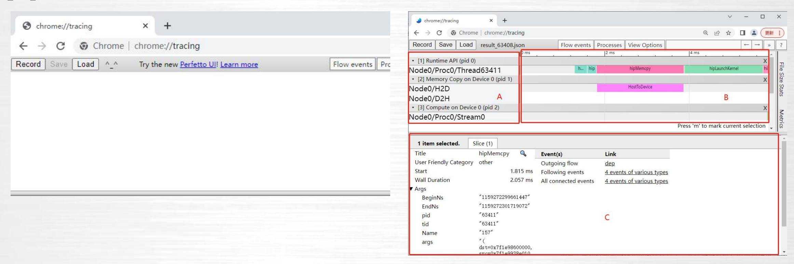
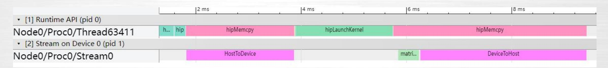
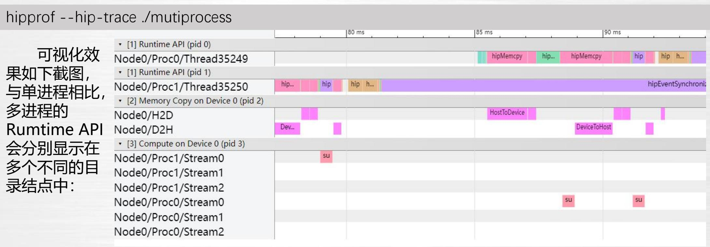
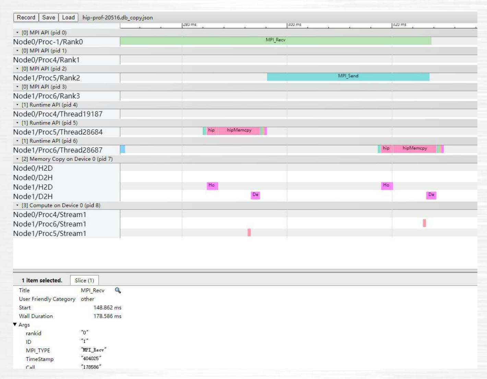
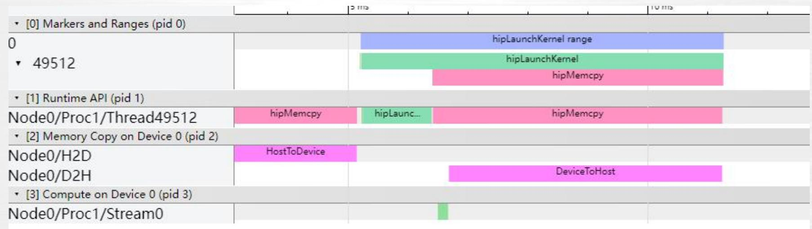

# **异构计算平台性能分析技术**

#### **目录**

| 01 | 异构平台性能分析工具hipprof简介 |
|----|---------------------|
| 02 | 异构平台hipprof指令介绍     |
| 03 | 异构平台hipprof功能演示     |

### **异构平台性能分析工具hipprof简介**

hipprof是DTK提供的性能分析工具,可以对HIP应用程序提供可视化的性能分析。提 供的功能有:

- 单进程、多进程、多节点的HIP API跟踪
- memcpy、核函数时间线跟踪
- ROCTX跟踪
- MPI日志解析
- PMC硬件计数器性能数据的统计输出

以及相关的辅助功能,下面从指令和功能演示两个角度分别对hipprof的使用进行介绍。

#### **目录**

| 01 | 异构平台性能分析工具hipprof简介 |  |
|----|---------------------|--|
| 02 | 异构平台hipprof指令介绍     |  |
| 03 | 异构平台hipprof功能演示     |  |

hipprof 指令的基本使用格式是:

hipprof [options] <app command line>

hipprof所有的指令执行过程是先解析后执行,因此指令的设置没有先后顺序的区分。 但是有优先级的区分,hipprof的分析原理是通过运行hip程序,收集过程中产生的性能数 据,这个过程可能会耗时较长,因此优先级最高的是不需要运行hip程序的指令。比如:

hipprof --hip-trace -h ./testhip

其中同时包含了--hip-trace和-h的指令,但是-h是显示帮助信息,并不需要执行hip 程序,因此优先级最高,这里忽略--hip-trace指令只执行-h的指令。

#### **基础指令**

-h 用于显示帮助信息,罗列并提示指令作用。

-o <output file> 指定输出文件的文件名。

-d <data directory> 指定输出数据的文件路径。

#### **tracing指令**

--hip-trace 用户开启HIP API以及核函数、memcpy的跟踪分析。

--hiptx-trace

用于开启hiptx程序的性能分析。如果用户想通过加入一些mark或者range信息 来确定程序内部和HIP API之间的关系,可以在用户HIP程序中加入roctx.h的接 口,并通过这条指令开启hiptx的跟踪分析,将用户调用roctx.h中的接口情况一 起显示出来。

--mpi-trace

如果用户使用了mpi做多进程、多结点的分析,在开启mpi日志的同时、使用- mpi-trace功能,hipprof会解析MPI的日志,并与HIP API做对应,同时显示出 来。

--db <db file name>

如果用户已经做了性能分析并生成了一个数据库文件(.db结尾),但是对输出 的可视化文件的范围、内容想做一些调整,可以直接操作数据库文件后,重新根 据数据库文件生成可视化文件,不需要重新运行HIP应用程序。

--db-merge <db file path>

指定目录,将目录内多个数据库文件合并为一个数据库文件,并生成合并后的可 视化脚本,用于多节点的性能分析,对比多个结点的性能情况,该指令不需要重 新运行HIP应用程序。

--index-range <start:end> 指定HIP API的顺序号范围,导出部分可视化脚本。这个指令可以和--db联合使 用,如果联合--db则不需要重新执行HIP应用。

#### --buffer-size

为了保证性能,galaxy产生的性能数据是存在缓存中,只有程序结束或者缓存满 了才会输出到数据库文件中,缓存大小默认是100000条HIP API数据。但是如果 程序不能正常结束(比如server程序,或者中间存在异常结束),又不能填满缓 存的情况下,使用这个指令可以缩小缓存空间,最小是1,牺牲一部分性能从而 提高数据的实时性。

#### **PMC指令**

PMC是统计硬件计数器的性能数据,统计过程中需要使用一定数量的硬件单元, 但是由于数量的限制,不能一次性将全部的性能数据全部输出,因此,PMC分 为三组,使用方式完全相同,三组中有一些重合,用户根据自己关心的指标,选 择一种一组进行分析。下面是分组的详细信息:

#### 通用PMC指标,每组都有:

| 参数                           | 说明                          |
|------------------------------|-----------------------------|
| GRBM_COUNT                   | GRBM<br>Tie<br>High-时钟计数。   |
| GRBM_GUI_ACTIVE              | GRBM<br>GUI活跃时钟周期数。         |
| SQ_ACTIVE_INST_VALU          | SQ指令器处理VALU指令的周期数。          |
| SQ_INSTS_FLAT_LDS_ONLY       | 发出的仅从LDS读取/写入LDS的FLAT指令数。   |
| SQ_INSTS_LDS                 | 发出的LDS指令数。                  |
| SQ_INSTS_VALU                | 发出的VALU指令数。                 |
| SQ_INSTS_VMEM_RD             | 发出的VMEM读取指令数(包括FLAT)        |
| SQ_INSTS_VMEM_WR             | 发出的VMEM写入指令数(包括FLAT)        |
| SQ_LDS_BANK_CONFLICT         | LDS因bank冲突而停止的周期数。          |
| SQ_WAIT_INST_LDS             | 等待LDS指令发出所花费的波周期数。以4个周期为单位。 |
| TA_TA_BUSY                   | TA块忙周期数。                    |
| TCP_TCP_TA_DATA_STALL_CYCLES | TCP暂停TA数据接口周期数。             |

#### --pmc

| 参数                      | 说明                     |
|-------------------------|------------------------|
| TA_FLAT_READ_WAVEFRONTS | TA处理的falt<br>操作码读取周期数。 |
| TCC_EA1_WRREQ_STALL     | TCC写入请求暂停的周期数。         |
| TCC_EA_WRREQ_STALL      | TCC写入请求暂停的周期数。         |
| TCC_HIT                 | TCC缓存命中数。              |
| TCC_MISS                | 缓存未命中数。UC读取计数为未命中。     |

#### --pmc-read

| 参数                      | 说明                 |
|-------------------------|--------------------|
| TA_FLAT_READ_WAVEFRONTS | TA处理的flat操作码读取数。   |
| TCC_EA1_RDREQ           | TCC/EA读取请求数。       |
| TCC_EA1_RDREQ_32B       | TCC/EA读取32byte请求数。 |
| TCC_EA_RDREQ            | TCC/EA读取请求数。       |
| TCC_EA_RDREQ_32B        | TCC/EA读取32byte请求数。 |

#### --pmc-write

| 参数                       | 说明                    |
|--------------------------|-----------------------|
| TA_FLAT_WRITE_WAVEFRONTS | TA处理的flat操作码写入次数。     |
| TCC_EA1_WRREQ            | TCC/EA写事务数(32字节或64字节) |
| TCC_EA1_WRREQ_64B        | TCC/EA写64byte事务数      |
| TCC_EA_WRREQ             | TCC/EA写事务数(32字节或64字节) |
| TCC_EA_WRREQ_64B         | TCC/EA写64byte事务数      |

#### **目录**

| 01<br>异构平台性能分析工具hipprof简介 |
|---------------------------|
|---------------------------|

**02 异构平台hipprof指令介绍**

**异构平台hipprof功能演示 03**

首先需要准备一个性能分析的HIP应用程序。在正确安装dtk-22.10.1以后,我们在dtk 目录下hip/sample中选择一个应用样例进行演示。

本次演示使用demo1MatrixTranspose程序,注意如果没有权限,可以把程序代码复 制到自己的用户目录下操作。

- Ø make生成可执行程序MatrixTranspose。
- Ø 运行程序看是否可以正常执行。

[root@dcunode1 0\_MatrixTranspose]# ./MatrixTranspose Device name Z100 PASSED!

Ø 使用hipprof进行性能分析。 hipprof后面除了可以用可执行程序,可以用python或者其他脚本,比如,hipprof --hiptrace python ...。

hipprof --hip-trace ./MatrixTranspose

| [root@dcunodel 0_MatrixTranspose]# hipprofhip-tr HIP_PROF:on Sat Oct 8 00:55:07 2022 HIP_PROF:process id '63408' HIP_PROF:db file './hip-prof-63408.db' HIP_PROF:out put file 'result_63408' HIP_PROF:profiling './MatrixTranspose' Device name Z100 PASSED! HIP_PROF:process end | ace ./MatrixTranspose           |                                                                     |                                                                    |                                                                                                                                                      |                |
|-----------------------------------------------------------------------------------------------------------------------------------------------------------------------------------------------------------------------------------------------------------------------------------|---------------------------------|---------------------------------------------------------------------|--------------------------------------------------------------------|------------------------------------------------------------------------------------------------------------------------------------------------------|----------------|
| HIP PROF:hip API statistics                                                                                                                                                                                                                                                       |                                 |                                                                     |                                                                    |                                                                                                                                                      |                |
| Name                                                                                                                                                                                                                                                                              | Calls                           | TotalDurationNs                                                     | AverageNs                                                          | Percentage                                                                                                                                           | į              |
| hipMemcpy<br> hipLaunchKernel<br> hipMalloc<br> hipFree<br> hipGetDeviceProperties<br> _hipPushCallConfiguration<br> _hipPopCallConfiguration                                                                                                                                     | 2<br> 1<br> 2<br> 2<br> 1<br> 1 | 5729517<br> 1839186<br> 497226<br> 154150<br> 3380<br> 3110<br> 790 | 2864758<br> 1839186<br> 248613<br> 77075<br> 3380<br> 3110<br> 790 | 69.6398078654402<br> 22.3545125477082<br> 6.04356756524177<br> 1.8736267616376<br> 0.0410824421299715<br> 0.0378007085870448<br> 0.00960210925523002 |                |
| Total                                                                                                                                                                                                                                                                             | 10                              | 8227359                                                             | 822735                                                             | 100.0                                                                                                                                                |                |
| HIP PROF:hip kernel statistics                                                                                                                                                                                                                                                    |                                 |                                                                     |                                                                    |                                                                                                                                                      |                |
| Name                                                                                                                                                                                                                                                                              | Calls                           | TotalDurationNs                                                     | AverageNs                                                          | Percentage                                                                                                                                           | İ              |
| matrixTranspose(float*, float*, int)                                                                                                                                                                                                                                              | 1                               | 393920                                                              | 393920                                                             | [100.0                                                                                                                                               | ï              |
| Total                                                                                                                                                                                                                                                                             | 1                               | 393920                                                              | 393920                                                             | 100.0                                                                                                                                                | Ī              |
| HIP PROF:dump json (13/13)<br>HIP PROF:finish                                                                                                                                                                                                                                     |                                 |                                                                     |                                                                    |                                                                                                                                                      | OF DE DE DE DE |

分析完成后会输出上图中的信息,包括HIP接口的统计表和核函数的统计表。Name列是函数或 者接口的名称;Calls表示调用的次数;TotalDurationNs是函数运行过程中总共消耗的时间, 以纳秒为单位;AverageNs是每次调用平均耗时,以纳秒为单位;Percentage是该函数占用的 总时间的百分比;最后一行total是表格的统计总计信息。

以上表格除了输出在终端外会另外形成两个csv格式的文件:

result\_63408.hiptrace.csv

result\_63408.kernel.csv

文件名称中63408是本次性能分析的进程号,将文件下载到本地后可以使用excel打开:

| Name                    | Calls | TotalDurationNs | AverageNs | Percentage  |
|-------------------------|-------|-----------------|-----------|-------------|
| hipMemcpy               | 2     | 5729517         | 2864758   | 69.63980787 |
| hipLaunchKernel         | 1     | 1839186         | 1839186   | 22.35451255 |
| hipMalloc               | 2     | 497226          | 248613    | 6.043567565 |
| hipFree                 | 2     | 154150          | 77075     | 1.873626762 |
| hipGetDeviceProperties  | 1     | 3380            | 3380      | 0.041082442 |
| hipPushCallConfiguratio | 1     | 3110            | 3110      | 0.037800709 |
| n                       |       |                 |           |             |
| hipPopCallConfiguration | 1     | 790             | 790       | 0.009602109 |
| Total                   | 10    | 8227359         | 822735    | 100         |

| Name                                       | Calls | TotalDurationNs | AverageNs | Percentage |
|--------------------------------------------|-------|-----------------|-----------|------------|
| matrixTranspose(float*,<br>float*,<br>int) | 1     | 393920          | 393920    | 100        |
| Total                                      | 1     | 393920          | 393920    | 100        |

除了输出统计表格以外,性能分析过程还会产生一个json格式的文件:

result\_63408.json

把文件下载到本地后在chrome浏览器中输入chrome://tracing打开可视化工具:



点击load按钮,选择下载好的json文件,打开可视化的程序运行过程和性能信息: 打开后左侧A区域显示的是性能数据的目录结构,Runtime API即HIP接口信息, Memcpy on device表示的是device上的memcpy信息,Compute on device表示核函数 在每个流上的运行信息,右侧B区域是具体每个操作所占用的时间和流程,我们称之为time line,可以通过键盘上的(w, s, a, d)按键进行放大缩小和前后滚动查看的操作,点击彩色单个 time line可以在下方C区域显示出函数的详细信息。

API和kernel之间存在异步操作,我们可以通过点击按钮Flow events,勾选DataFlow显 示全部的异步操作关系。

默认情况下,memcpy和核函数是分开显示的,memcpy的信息并没有按照流进行显示, 如果需要和核函数一样按照流进行显示,在性能分析过程中增加指令--group-stream,也可 以通过已经生成的数据库文件重新生成可视化文件,指令:

hipprof --db hip-prof-63408.db --group-stream

#### 重新生成的json文件打开后效果如下:



少了memcpy的目录,memcpy的数据与核函数一起显示在流中。

多进程的性能分析分为普通的多进程应用分析和MPI程序多进程分析,这里分别进行演示,MPI多 进程在下一个小节中。

hipprof本身具有多进程的管理模块,可以和单进程HIP程序一样直接使用hipprof进行分析。本次 示例使用一个普通的HIP程序,通过fork产生多个进程,指令:



这里如果是单节点多进程的MPI程序,也可以和普通的多进程程序一样做分析:

hipprof --hip-trace mpirum ...

#### **hipprof功能演示 -MPI多节点多进程HIP接口跟踪可视化**

在多节点多进程的MPI程序性能分析过程需要两个步骤:

每个进程启动一个hipprof分别对每个进程进行分析,生成数据库文件,这里需要把mpirun 放在 hipprof前面,再由hipprof来启动HIP程序。

将多个数据库文件进行合并,生成合并后的可视化脚本。

如果MPI开启了日志,hipprof可以通过增加--mpi-trace指令对MPI日志进行解析并显示在可视 化页面中,本次示例使用两个节点,每个节点使用两个进程,一共4个进程:

- Rank 0进程用于等待接收其他三个进程完成的信号。
- Rank 1进程先执行一次核函数,然后发送信号给Rank0。
- Rank 2进程先执行一次核函数,然后发送信号给Rank0。
- Rank 3进程先发送信号给Rank0,然后执行一次核函数。

#### **hipprof功能演示 -MPI多节点多进程HIP接口跟踪可视化**

下面做详细步骤演示: 单节点四进程运行,看程序是否能够正常执行:

mpirun -np 4 ./testmpi

单节点四进程加MPI preload日志:

#### mpirun

-x LD\_PRELOAD=mpitracer.so:/opt/hpc/software/mpi/hpcx/v2.7.4/gcc-7.3.1/lib/libmpi.so.40

-np 4

./testmpi

#### 双节点四进程,加上性能分析指令:

#### mpirun

-x LD\_PRELOAD=/public/software/compiler/rocm/dtk-22.10/lib/mpitracer.so:

/opt/hpc/software/mpi/hpcx/v2.7.4/gcc-7.3.1/lib/libmpi.so.40

-np 4 -H i02r1n08:2,i02r1n04:2

/public/software/compiler/rocm/dtk-22.10/bin/hipprof --hip-trace --mpi-trace ./testmpi

#### **hipprof功能演示 -MPI多节点多进程HIP接口跟踪可视化**

因为是在多节点上执行指令,避免环境和相对路径影响,这里对指令和引用库加上了绝对路径。 执行过程中mpirum会在两个节点上分别启动两个hipprof程序,再由hipprof启动MPI程序,总共 四个进程,分别进行性能数据的搜集,并输出四个数据库文件。如果需要对四个进程的性能数据放在 一起做可视化分析,那么执行第二步,对四个数据进行合并,生成统一可视化文件。

hipprof --db-merge .

| HIP_PROF:merge file ./hip-prof-19180.db. HIP_PROF:merge file ./hip-prof-19181.db. |                 |                 |           |                     |  |  |
|-----------------------------------------------------------------------------------|-----------------|-----------------|-----------|---------------------|--|--|
| IP_PROF:merge file ./hip-p                                                        | prof-28679.db.  |                 |           |                     |  |  |
| IP_PROF:merge file ./hip-p                                                        | orof-28678.db.  |                 |           |                     |  |  |
| lame                                                                              | Calls           | TotalDurationNs | AverageNs | Percentage          |  |  |
| ipMemcpy                                                                          | 9               | 30654446        | 3406049   | 69.9298350750713    |  |  |
| ipHostMalloc                                                                      |                 | 6145812         | 682868    | 14.0200093507609    |  |  |
| ipStreamCreate                                                                    |                 | 1740097         | 290016    | 3.96956109481236    |  |  |
| ipMalloc                                                                          |                 | 1454770         | 161641    | 3.31866464564916    |  |  |
| ipDeviceReset                                                                     |                 | 1432211         | 477403    | 3.26720238306388    |  |  |
| ipHostFree                                                                        |                 | 1169613         | 129957    | 2.66815600554841    |  |  |
| ipStreamDestroy                                                                   |                 | 830239          | 138373    | 1.89396593051762    |  |  |
| ipFree                                                                            |                 | 271191          | 30132     | 0.618648985006731   |  |  |
| ipLaunchKernel                                                                    |                 | 114377          | 38125     | 0.260920218436876   |  |  |
| hipPushCallConfiguration                                                          |                 | 12704           | 4234      | 0.0289807431128818  |  |  |
| ipSetDevice                                                                       |                 | 4952            | 1650      | 0.0112966498657896  |  |  |
| ipGetDeviceProperties                                                             |                 | 3051            | 1017      | 0.00696003205584086 |  |  |
| _hipPopCallConfiguration                                                          |                 | 2542<br>        | 847       | 0.00579888609831119 |  |  |
| lame                                                                              | Calls           | TotalDurationNs | AverageNs | Percentage          |  |  |
| sumArrays(float*, float*,                                                         | float*, int)" 3 | 1723992         | 574664    | 100.0               |  |  |

根据提示,生成了新的进程号为20516的数据文件,下载对应的json文件在chrome浏览器中进行 可视化。

#### **hipprof功能演示 -MPI多节点多进程HIP接口跟踪可视化**



左边目录结构发生了一些变化,增加了MPI API的时间线显示。

### **hipprof功能演示-hiptx接口跟踪可视化**

hiptx是hipprof提供的外部接口,可以通过对roctx.h头文件的引用,添加用户需 要的API时间点,再与HIP API做可视化对比。roctx.h提供了mark和range的接口。 正确头文件并使用ROCTX接口后,在性能分析时候添加--hiptx-trace指令。

hipprof --hip-trace --hiptx-trace ./testroctx




其中,Markers and Ranges中显示的内容是根据用户程序调用roctx中的API做的 标记生成并显示的。

### **hipprof功能演示-hiptx接口跟踪可视化**

#### 示例代码如下:

```
// Memory transfer from host to device
hipMemcpy(gpuMatrix, Matrix, NUM * sizeof(float), hipMemcpyHostToDevice);
roctxMark("before hipLaunchKernel");
int rangeId = roctxRangeStart("hipLaunchKernel range");
roctxRangePush("hipLaunchKernel");
hipLaunchKernelGGL(
 matrixTranspose, dim3(WIDTH / THREADS_PER_BLOCK_X, WIDTH / THREADS_PER_BLOCK_Y), dim3(THREADS_PER_BLOCK_X, THREADS_PER_BLOCK_Y), 0, 0, gpuTransposeMatrix, gpuMatrix, WIDTH);
roctxMark("after hipLaunchKernel");
```

其中MARK信息没有时间线,只是对时间轴进行标记,在可视化页面中显示的宽度较 窄,需要放大后才能看到。

| hipLaunchKemel | inge      |
|----------------|-----------|
| hipLaunchKern  |           |
| after hi       | hipMemcpy |
|                |           |
|                | hipMemcpy |
|                |           |
|                |           |

### **hipprof功能演示-PMC性能分析**

通过trace的分析,我们可以直观的看到HIP API以及kernel函数的整体性能情况,进行流程调整, 热点函数寻找。如果性能瓶颈产生某个核函数上,我们可以使用PMC指令进一步对核函数的性能和行为 进行分析。

还以MatrixTranspose程序为例,如果需要指定某个核函数,可以增加指令--kernel-name加函数 名来控制输出范围,指令如下:

hipprof --pmc ./MatrixTranspose

执行结束后,会产生PMC数据文件: pmc\_results\_130.txt 其中130是进程识别号,打开后可以看到具 体的性能指标,根据性能指标辅助定位核函数的 性能问题,做优化改进的方案。

